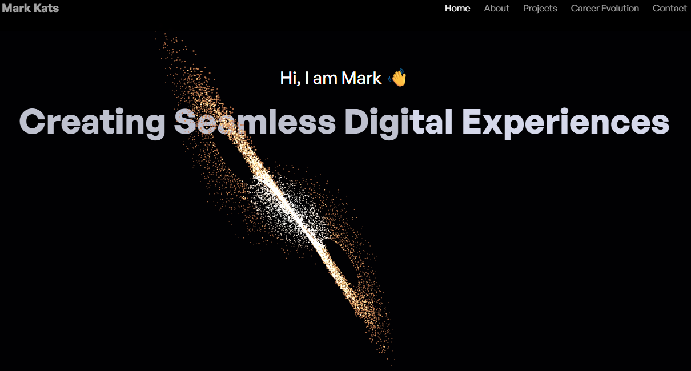

# 🌌 Three.js Portfolio

> A cutting-edge portfolio website showcasing the intersection of mathematics, 3D graphics, and modern web development.

[](https://markkats.com)
[](https://reactjs.org/)
[](https://threejs.org/)
[](https://vitejs.dev/)
[](LICENSE)

## ✨ Features

### 🎯 **Interactive 3D Visualizations**
- **Lorenz Attractor**: Real-time mathematical chaos simulation with 10,000 particles
- **3D Globe**: Interactive world map with animated flight paths
- **Project Showcase**: 3D laptop models with video textures

### 🚀 **Modern Tech Stack**  
- **React 19** with latest concurrent features
- **Three.js** for advanced 3D graphics
- **GSAP** for smooth animations
- **Tailwind CSS** for responsive design
- **Vite** for lightning-fast development

### 📱 **Responsive Design**
- Optimized for desktop, tablet, and mobile
- Adaptive 3D performance based on device capabilities
- Touch-friendly interactions

## 🎥 Preview

<div align="center">
  
  <p><em>Lorenz Attractor visualization with Gargantua-inspired color mapping</em></p>
</div>

## 🚀 Quick Start

### Prerequisites
- **Node.js** 18+ 
- **npm** or **yarn**

### Installation

1. **Clone the repository**
   ```bash
   git clone https://github.com/MarkKatsDesign/threejs-portfolio.git
   cd threejs-portfolio
   ```

2. **Install dependencies**
   ```bash
   npm install
   ```

3. **Set up environment variables**
   ```bash
   cp .env.example .env
   ```
   
   Then edit `.env` with your EmailJS credentials:
   ```env
   VITE_EMAILJS_SERVICE_ID=your_service_id
   VITE_EMAILJS_TEMPLATE_ID=your_template_id  
   VITE_EMAILJS_PUBLIC_KEY=your_public_key
   ```

4. **Start development server**
   ```bash
   npm run dev
   ```

5. **Open your browser**
   ```
   http://localhost:5173
   ```

## 🛠️ Scripts

| Command | Description |
|---------|-------------|
| `npm run dev` | Start development server with HMR |
| `npm run build` | Build for production |
| `npm run preview` | Preview production build |
| `npm run lint` | Run ESLint code analysis |

## 📁 Project Structure

```
src/
├── 📁 components/           # Reusable UI components
│   ├── 🌌 LorenzAttractor   # Mathematical particle system
│   ├── 💻 Laptop            # 3D model with video textures
│   ├── 👤 Developer         # Animated character model
│   └── 📷 HeroCamera        # Dynamic camera controller
├── 📁 sections/             # Page sections
│   ├── 🏠 Hero              # Landing with 3D background
│   ├── 🌍 About             # Interactive globe
│   ├── 💼 Projects          # 3D project showcase
│   ├── 📈 CareerEvolution   # Professional timeline
│   └── 📧 Contact           # Contact form with EmailJS
└── 📁 constants/            # Data and configuration
```

## 🎨 Key Technologies

### **Frontend**
- **React 19.0.0** - Latest React with concurrent features
- **Vite 6.1.0** - Next-generation frontend tooling
- **Tailwind CSS** - Utility-first CSS framework

### **3D Graphics**  
- **Three.js 0.173.0** - Core 3D graphics library
- **@react-three/fiber** - React renderer for Three.js
- **@react-three/drei** - Useful helpers and abstractions
- **react-globe.gl** - Interactive 3D globe

### **Animation**
- **GSAP 3.12.7** - Professional animation library
- **Framer Motion** (planned) - React animation library

### **Communication**
- **EmailJS** - Client-side email service
- **React Responsive** - Responsive design utilities

## 🎯 Featured Sections

### **Hero - Lorenz Attractor**
- Mathematical chaos visualization 
- 10,000-particle real-time simulation
- Gargantua-inspired color mapping
- Auto-rotating camera system

### **About - Interactive Globe**  
- Real geographical coordinates
- Animated flight paths between cities
- Auto-rotation with orbit controls
- Location markers with tooltips

### **Projects - 3D Showcase**
- Interactive project carousel
- 3D laptop models with video textures
- QR codes for mobile apps
- Technology stack visualization

### **Career Evolution - Timeline**
- Interactive professional timeline
- Context-specific character animations
- Smooth GSAP transitions
- Responsive design adaptation

## 📊 Performance

- ⚡ **Lighthouse Score**: 95+
- 🎯 **Core Web Vitals**: Optimized
- 📱 **Mobile Performance**: 60 FPS animations
- 🖥️ **Desktop Experience**: Full-featured 3D

## 🔧 Configuration

### **EmailJS Setup**
1. Create account at [emailjs.com](https://emailjs.com)
2. Create email service and template
3. Add credentials to `.env` file
4. Update template variables as needed

### **Deployment**
Optimized for deployment on:
- **Vercel** (recommended)
- **Netlify** 
- **GitHub Pages**
- **Firebase Hosting**

## 📄 License

This project is licensed under the MIT License - see the [LICENSE](LICENSE) file for details.

> **Note:** Demo videos and certain assets in this repository are for personal portfolio demonstration only and are not licensed for reuse or redistribution.

## 🙏 Acknowledgments

- **Three.js Community** - For incredible 3D web graphics
- **React Team** - For the amazing framework
- **GSAP** - For smooth animations
- **Vercel** - For seamless deployment

## 📞 Contact

**Mark Kats** - [mark.kats.career@gmail.com](mailto:mark.kats.career@gmail.com)

**Portfolio**: [markkats.com](https://markkats.com)  
**LinkedIn**: [mark-kats](https://www.linkedin.com/in/mark-kats/)  
**GitHub**: [MarkKatsDesign](https://github.com/MarkKatsDesign/)

---

<div align="center">
  <p><strong>Built with ❤️ using React, Three.js, and modern web technologies</strong></p>
  <p><em>⭐ Star this repo if you found it helpful!</em></p>
</div>